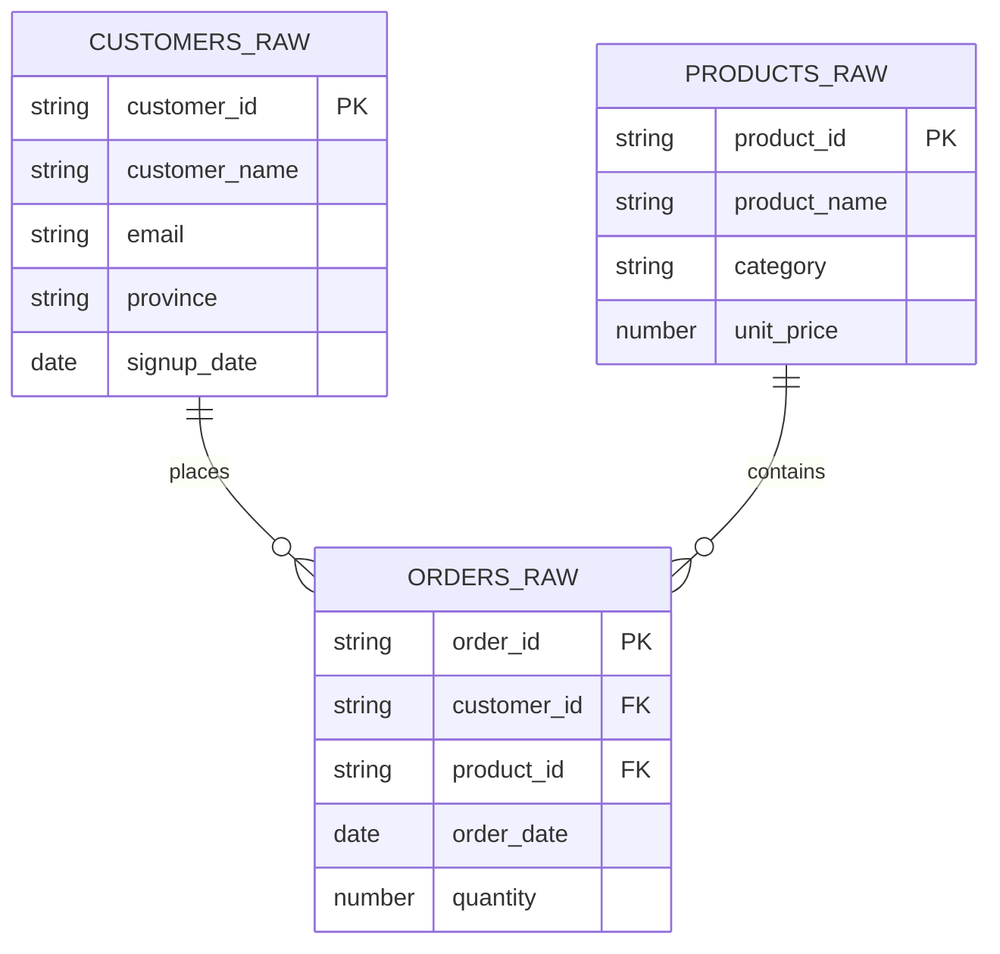

# kasi-mart-data-engineering-project1
### Project 1 Overview 📌
We were tasked to do a Data Engineering Project using Snowflake cloud-based platform as the only tool.
## Data that was provided. When loading the csv files into Snowflake, I renamed them with an _raw.
| File | Rows | Columns | Role |
|---|---|---|---|
| customers_raw.csv | 50 | customer_id, customer_name, email, province, signup_date | Dimension |
| products_raw.csv | 20 | product_id, product_name, category, unit_price | Dimension |
| orders_raw.csv | 150 | order_id, customer_id, product_id, order_date, quantity | Fact |
## Data model

## What I submitted as evidence
- Screenshot of the Snowflake database, schema, and tables
- The load statements used (COPY INTO or equivalent)
- A `.sql` file with all four queries
- Results for each query (sql script and CSV export)
- A write-up OF 4 paragraphs to explain the queries
